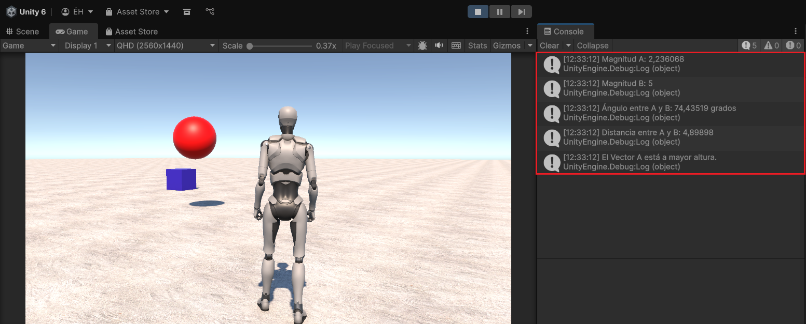
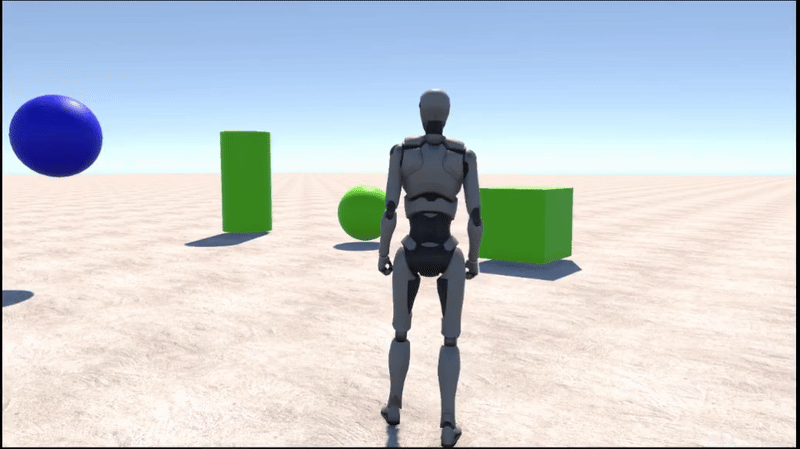

# Practica-2-II

Autor: Eric Bermúdez Hernández

Email: alu0101517476@ull.edu.es

----

# Índice


----

Descripción del trabajo realizado

1. Ejercicio 1: Script colores

Para realizar el ejercicio, he hecho el siguiente script y lo he asignado a un cubo.
Código del Script:

```C#
using UnityEngine;

public class ColorChanger : MonoBehaviour
{
    // Frames de espera antes de cambiar el color (configurable desde el inspector)
    public int framesToWait = 120;

    // Vector con 3 posiciones (R, G, B)
    private float[] colorValues = new float[3];

    // Contador de frames
    private int frameCounter = 0;

    private Renderer objectRenderer;

    void Start()
    {
        // Inicializamos el vector con valores aleatorios entre 0 y 1
        for (int i = 0; i < colorValues.Length; i++)
        {
            colorValues[i] = Random.Range(0.0f, 1.0f);
        }

        // Obtenemos el Renderer del objeto para poder cambiarle el color
        objectRenderer = GetComponent<Renderer>();

        // Aplicamos el color inicial
        ApplyColor();
    }

    void Update()
    {
        frameCounter++;

        // Cuando llegue al número de frames, cambiar un valor del vector
        if (frameCounter >= framesToWait)
        {
            // Elegir una posición aleatoria (0=R, 1=G, 2=B)
            int index = Random.Range(0, 3);

            // Asignar un nuevo valor aleatorio entre 0 y 1
            colorValues[index] = Random.Range(0.0f, 1.0f);

            // Aplicar el nuevo color al objeto
            ApplyColor();

            // Reiniciar contador
            frameCounter = 0;
        }
    }

    // Método para convertir el array en un Color y asignarlo al objeto
    private void ApplyColor()
    {
        Color newColor = new Color(colorValues[0], colorValues[1], colorValues[2]);
        objectRenderer.material.color = newColor;
    }
}

```

A continuación se encuentra un vídeo en el que se demuestra el comportamiento del cubo al asignarle el Script:


2. Ejercicio 2: Magnitud vectores

Para desarrollar el ejercicio, se ha creado un objeto 3D Esfera, a la cual se le ha añadido el color rojo para resaltarla. Posteriormente se ha creado el siguiente Script y se le ha asignado a la Esfera. 
El código del Script es el siguiente:
```C#
using UnityEngine;

public class VectorOperations : MonoBehaviour
{
    // Vectores configurables desde el Inspector
    public Vector3 vectorA = new Vector3(1, 2, 0);
    public Vector3 vectorB = new Vector3(3, 0, 4);


    // Variables para mostrar resultados en el inspector
    [Header("Resultados")]
    public float magnitudA;
    public float magnitudB;
    public float angulo;
    public float distancia;
    public string mayorAltura;

    void Start()
    {
        vectorA = new Vector3(1, 2, 0);
        vectorB = new Vector3(3, 0, 4);
        // a) Magnitud de cada vector
        magnitudA = vectorA.magnitude;
        magnitudB = vectorB.magnitude;

        // b) Ángulo entre ambos (Unity lo da en grados)
        angulo = Vector3.Angle(vectorA, vectorB);

        // c) Distancia entre ambos
        distancia = Vector3.Distance(vectorA, vectorB);

        // d) Vector con mayor altura (componente Y)
        if (vectorA.y > vectorB.y)
            mayorAltura = "El Vector A está a mayor altura.";
        else if (vectorB.y > vectorA.y)
            mayorAltura = "El Vector B está a mayor altura.";
        else
            mayorAltura = "Ambos vectores tienen la misma altura.";

        // Mostrar en consola
        Debug.Log("Magnitud A: " + magnitudA);
        Debug.Log("Magnitud B: " + magnitudB);
        Debug.Log("Ángulo entre A y B: " + angulo + " grados");
        Debug.Log("Distancia entre A y B: " + distancia);
        Debug.Log(mayorAltura);
    }
}

```

El resultado de la ejecución del Script al iniciar el juego es el siguiente:


Como se puede apreciar, en la consola aparecen las magnitudes de A y B, el ángulo que forman los dos vectores, la distancia entre ellos y que vector está a más altura, que en este caso es el A. Para que salgan estos valores en la consola, le hemos asignado valores a los vectores al iniciar la ejecución.

3. Ejercicio 3: Mostrar en pantalla el vector con la posición de la esfera.

Para resolver el ejercicio desarrollé un Script, el cual he añadido a la esfera con el siguiente código que lo que hace es mostrar por consola la posición de la esfera:

```C#
using UnityEngine;

public class ShowSpherePosition : MonoBehaviour
{
    void Update()
    {
        // Opción A (más directa)
        Vector3 position = transform.position;

        // Opción B (equivalente, usando GetComponent<Transform>())
        // Vector3 position = GetComponent<Transform>().position;

        Debug.Log("Posición de la esfera: " + position);
    }
}

```
En la siguiente imagen se encuentra la comprobación de que el Script funciona:


4. Ejercicio 4: Mostrar la distancia del cubo y el cilindro de la esfera

Para completar el siguiente ejercicio, lo que he hecho ha sido crear un Script con el siguiente código y añadirlo a una nueva esfera que he creado. A esta nueva esfera le he dado el color azul para diferenciarla de la otra que es roja y que ya tenía otro Script añadido.
Código del Script:

```C#
using UnityEngine;

public class DistanceToObjects : MonoBehaviour
{
    // Referencias a los otros objetos (se buscarán por Tag)
    private GameObject cube;
    private GameObject cylinder;

    void Start()
    {
        // Buscar los objetos por sus etiquetas
        cube = GameObject.FindWithTag("cube");
        cylinder = GameObject.FindWithTag("cylinder");

        // Verificar que se encontraron
        if (cube == null || cylinder == null)
        {
            Debug.LogError("No se encontraron los objetos con las etiquetas 'cube' o 'cylinder'.");
            return;
        }

        // Calcular distancias
        float distanceToCube = Vector3.Distance(transform.position, cube.transform.position);
        float distanceToCylinder = Vector3.Distance(transform.position, cylinder.transform.position);

        // Mostrar en consola
        Debug.Log("Distancia entre la esfera y el cubo: " + distanceToCube);
        Debug.Log("Distancia entre la esfera y el cilindro: " + distanceToCylinder);
    }
}

```

En la siguiente imagen se puede comprobar que el Script funciona correctamente al mostrar la distancia entre el cubo y el cilindro con la esfera por consola:


5. Ejercicio 5: Vectores numéricos

Para realizar el ejercicio, lo primero que he hecho ha sido crear 3 objetos 3D básicos, los cuales son una Esfera, un Cubo y un Cilindro en la misma escena. Después cree 2 Scripts, el primero se llama `DesplazamientoObjeto.cs`, el cual fue asignado a cada uno de estos 3 objetos. Para finalizar cree un EmptyObject el cual le asigné un nuevo script el cual llamé `MarcadorColocacion.cs`. Acto seguido en el inspector del EmptyObject, asigné los 3 objetos 3D básicos de la siguiente forma:
- Objeto A: Sphere Green

- Objeto B: Cube Green

- Objeto C: Cylinder Green

Dentro del mismo componente EmptyObject, configuré los offsets del objeto con valores de ejemplo para que cuando saltara con la barra espaciadora los objetos se movieran de su posición original en función del offset. 
Después para que funcionara todo esto a la hora de saltar con la barra espaciadora, hice lo siguiente:
- Edit --> Project Settings --> Input Manager --> Axes
- Busqué `Jump` y cambie el valor de `Positive Button` a `Space`

Después cambié lo siguiente: 
- Edit --> Project Settings --> Player --> Other Settings --> Active Input Handling
- Cambié el valor a `Both`

A continuación mostraré el código de los Scripts mencionados anteriormente:

`DesplazamientoObjeto.cs`:

```C#
using UnityEngine;

public class DesplazamientoObjeto : MonoBehaviour
{
    [Header("Desplazamiento relativo a la posición original")]
    public Vector3 desplazamiento = Vector3.zero;

    [HideInInspector] public Vector3 posicionOriginal;

    void Awake()
    {
        // Guardamos la posición original al iniciar la escena
        posicionOriginal = transform.position;
    }
}

```

`MarcadorColocacion.cs`:

```C#
using UnityEngine;

public class MarcadorColocacion : MonoBehaviour
{
    [Header("Referencia a los 3 objetos a colocar")]
    public DesplazamientoObjeto objetoA;
    public DesplazamientoObjeto objetoB;
    public DesplazamientoObjeto objetoC;

    [Header("Desplazamientos configurados en el MARCADOR (Vector3)")]
    public Vector3 offsetA = new Vector3(0f, 0f, 0f);
    public Vector3 offsetB = new Vector3(0f, 0f, 0f);
    public Vector3 offsetC = new Vector3(0f, 0f, 0f);

    [Header("Entrada")]
    [Tooltip("Nombre del eje definido en el Input Manager (por defecto 'Jump' = barra espaciadora).")]
    public string ejeSalto = "Jump";
    [Tooltip("Umbral para considerar que la barra está pulsada (0..1).")]
    public float umbral = 0.5f;

    // Para detectar flanco de subida y no disparar cada frame
    private bool estabaPulsado = false;

    void Update()
    {
        float valorEje = Input.GetAxis(ejeSalto); // -> usa el Input Manager (antiguo)
        bool pulsadoAhora = valorEje > umbral;

        // Flanco de subida: pasa de no pulsado -> pulsado
        if (pulsadoAhora && !estabaPulsado)
        {
            ColocarObjetos();
        }

        estabaPulsado = pulsadoAhora;
    }

    private void ColocarObjetos()
    {
        if (objetoA != null)
        {
            // Opción A: usar los offsets definidos en el MARCADOR (recomendado por enunciado)
            objetoA.transform.position = objetoA.posicionOriginal + offsetA;

            // (Opcional) Reflejar el offset del marcador en el componente del objeto:
            objetoA.desplazamiento = offsetA;
        }

        if (objetoB != null)
        {
            objetoB.transform.position = objetoB.posicionOriginal + offsetB;
            objetoB.desplazamiento = offsetB;
        }

        if (objetoC != null)
        {
            objetoC.transform.position = objetoC.posicionOriginal + offsetC;
            objetoC.desplazamiento = offsetC;
        }

        Debug.Log("Objetos colocados según los desplazamientos del marcador.");
    }
}

```

Para ilustrar todos estos cambios, adjunto el siguiente gift en el que se aprecia como al saltar los objetos 3D básicos se mueven de su posición original:



6. Ejercicio 6: Velocidad al Cubo

Para completar el ejercicio, lo que hice fue crear un cubo y adjuntarle un Script con el siguiente código: 

```C#
using UnityEngine;

public class ArrowSpeedReporter : MonoBehaviour
{
    [Header("Configuración")]
    public float velocidad = 5f;
    public string ejeHorizontal = "Horizontal";
    public string ejeVertical = "Vertical";

    void Update()
    {
        // Leemos los valores de los ejes (sin suavizado)
        float h = Input.GetAxisRaw(ejeHorizontal);
        float v = Input.GetAxisRaw(ejeVertical);
        //  FLECHAS HORIZONTALES
        if (Input.GetKeyDown(KeyCode.RightArrow))
            Debug.Log($"→ Flecha derecha pulsada | Resultado: {velocidad * h}");
        
        if (Input.GetKeyDown(KeyCode.LeftArrow))
            Debug.Log($"← Flecha izquierda pulsada | Resultado: {velocidad * h}");
        //  FLECHAS VERTICALES
        if (Input.GetKeyDown(KeyCode.UpArrow))
            Debug.Log($"↑ Flecha arriba pulsada | Resultado: {velocidad * v}");
        
        if (Input.GetKeyDown(KeyCode.DownArrow))
            Debug.Log($"↓ Flecha abajo pulsada | Resultado: {velocidad * v}");
        //  TECLAS A / D
        if (Input.GetKeyDown(KeyCode.D))
            Debug.Log($"Tecla D pulsada | Resultado: {velocidad * h}");
        
        if (Input.GetKeyDown(KeyCode.A))
            Debug.Log($"Tecla A pulsada | Resultado: {velocidad * h}");
        //  TECLAS W / S
        if (Input.GetKeyDown(KeyCode.W))
            Debug.Log($"Tecla W pulsada | Resultado: {velocidad * v}");
        
        if (Input.GetKeyDown(KeyCode.S))
            Debug.Log($"Tecla S pulsada | Resultado: {velocidad * v}");
    }
}

```

De esta manera, cuando se pusen o bien WASD o las flechas el cubo calcula y muestra por consola `velocidad * valorHorizontal` en caso del eje horizontal y `velocidad * valorVertical` en el del ejer vertical.
En el siguiente vídeo se muestra el funcionamiento del script:

# **PONER VIDEO DEL EJERCICIO 7 PULSANDO LAS TECLAS**

7. Ejercicio 7: Tecla H con la función de disparo

# **HECHO, ESCRIBIR TODOS LOS PASOS QUE HICISTE, QUE TE DIJO EL CHATGPT Y MOSTRAR CAPTURA CUANDO APRIETAS LA H**